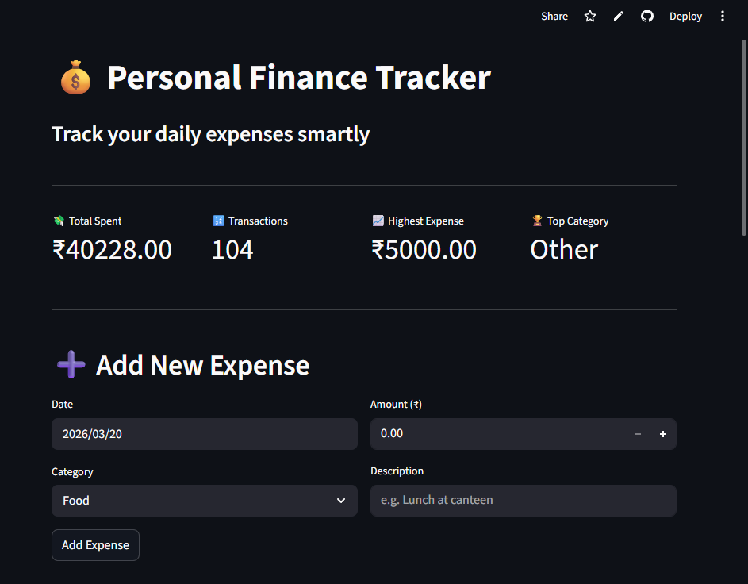
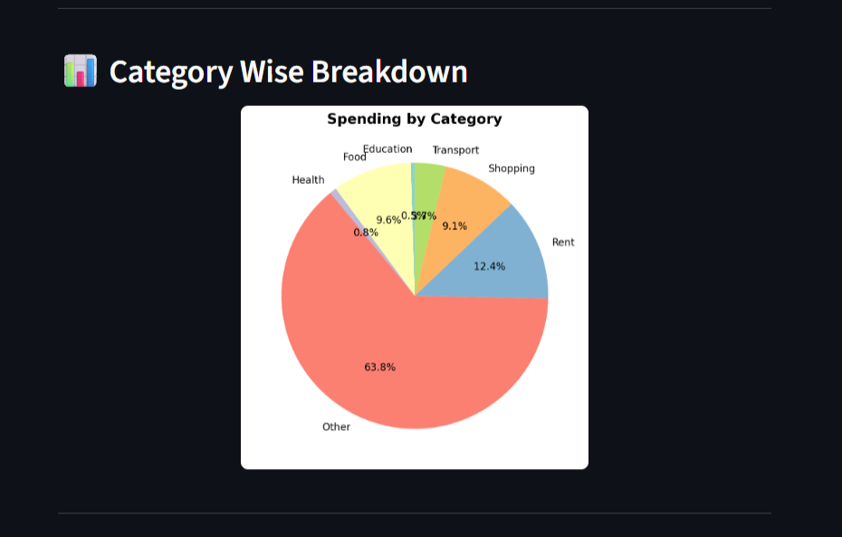
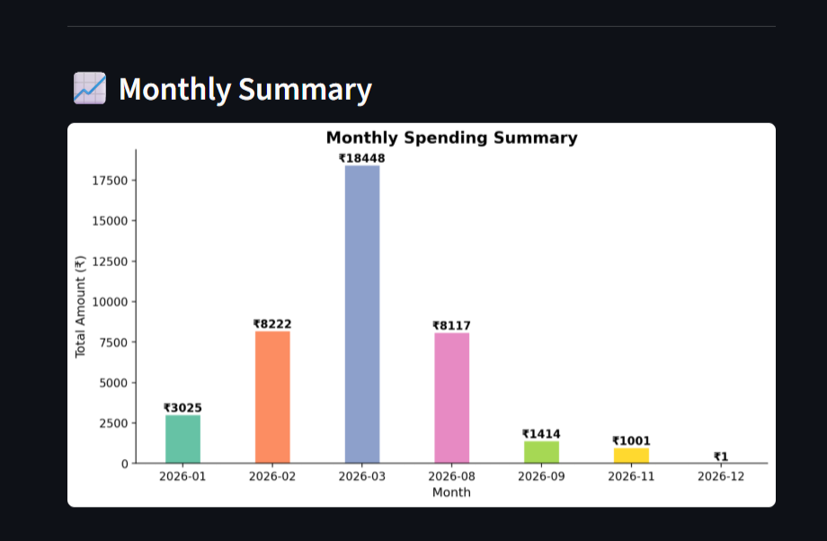

# 💰 Personal Finance Tracker with Visual Analytics

A full-stack web application built with Python and Streamlit to track, manage and visualize daily expenses — including auto-import from Paytm UPI PDF statements.

🔗 **Live Demo:** https://personal-finance-tracker-hvurvtpaixefbvmzkzy2sx.streamlit.app

---

## ✨ Features

- ➕ **Add Expenses** — date, category, amount and description
- 🗑️ **Delete Expenses** — remove any entry instantly
- 📋 **Expense Table** — view all expenses with total spent
- 📊 **Pie Chart** — category wise spending breakdown
- 📈 **Bar Graph** — monthly spending summary
- 🏦 **Paytm PDF Import** — auto-import transactions from Paytm UPI statement
- 📊 **Summary Dashboard** — total spent, transactions, highest expense, top category
- 💾 **CSV Storage** — data persists across sessions

---

## 🛠️ Tech Stack

| Technology | Purpose |
|-----------|---------|
| Python | Core programming language |
| Streamlit | Web interface |
| Pandas | Data handling and CSV operations |
| Matplotlib | Pie charts and bar graphs |
| pdfplumber | Paytm PDF statement parsing |
| openpyxl | Excel file support |

---

## 🚀 Run Locally

**1. Clone the repository**
```bash
git clone https://github.com/Shanky085/personal-finance-tracker.git
cd personal-finance-tracker
```

**2. Install dependencies**
```bash
pip install -r requirements.txt
```

**3. Run the app**
```bash
streamlit run app.py
```

**4. Open browser**
```
http://localhost:8501
```

---

## 📁 Project Structure

```
expense_tracker/
│
├── app.py              # Main Streamlit application
├── requirements.txt    # Python dependencies
├── expenses.csv        # Local data storage (auto-created)
└── README.md           # Project documentation
```

---

## 📸 Screenshots

### Dashboard


### Pie Chart


### Monthly Summary


---

## 🔑 Key Features Explained

### Paytm PDF Auto-Import
The app reads your Paytm UPI statement PDF and automatically:
- Extracts all transactions
- Maps Paytm tags to expense categories
- Imports only payments (skips received money)
- Shows preview before importing

### Smart Category Mapping
| Paytm Tag | App Category |
|-----------|-------------|
| Food | Food |
| Groceries | Food |
| Medical | Health |
| Taxi | Transport |
| Shopping | Shopping |
| Miscellaneous | Other |

---

## 👨‍💻 Developer

**Shanky Pal**
- 1st Year B.Tech CSE Student
- GitHub: [Shanky085](https://github.com/Shanky085)
- LinkedIn: [shanky-pal](https://www.linkedin.com/in/shanky-pal-b27413174)

---

## 📄 License

This project is open source and available under the [MIT License](LICENSE).

---

⭐ If you found this useful, please give it a star on GitHub!