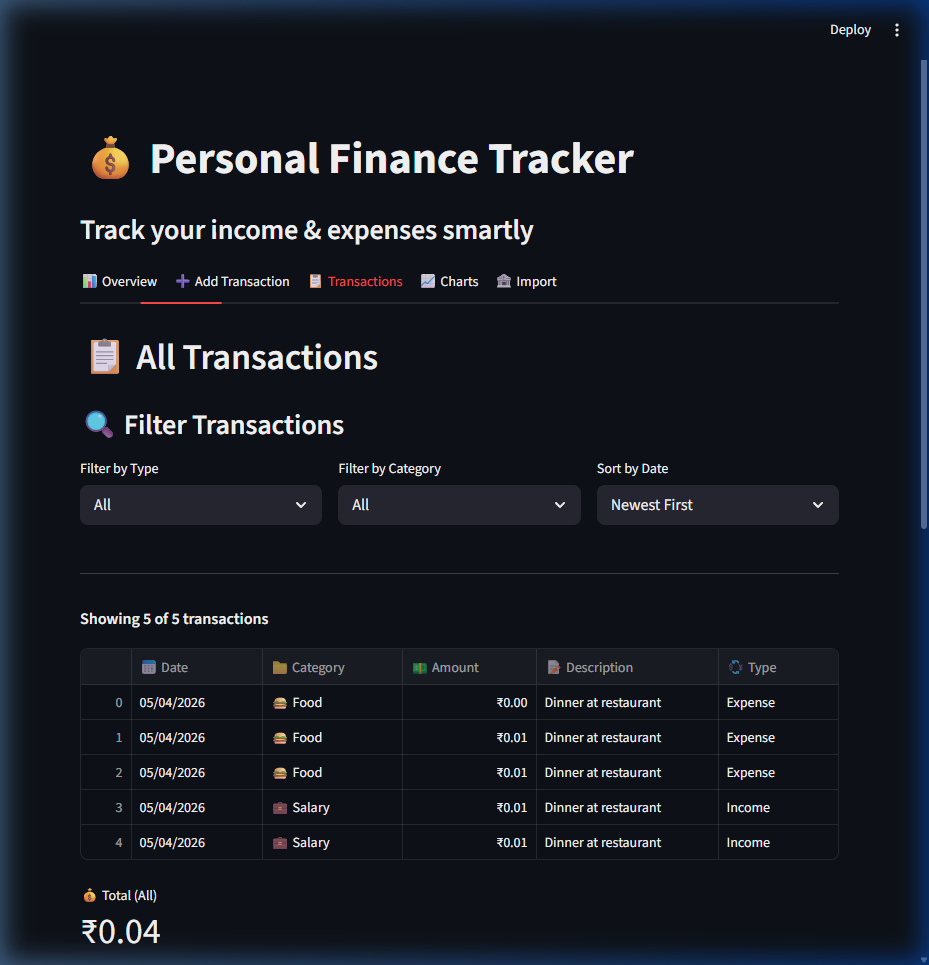
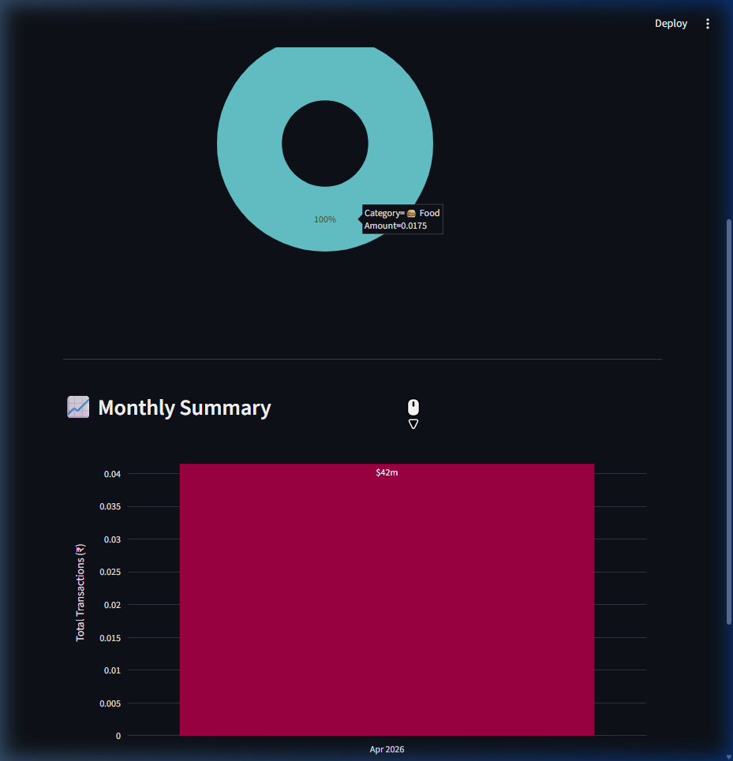

<div align="center">
  <h1>💰 Personal Finance Tracker v2.0</h1>
  <p>Track your income & expenses smartly with a visually stunning AI-powered dashboard.</p>
</div>

---

## ✨ Features

Personal Finance Tracker v2.0 introduces a massive architecture and UI upgrade over the original monolithic script.

**🚀 v2.0 Improvements:**
- 🖼️ **Glassmorphism UI** - Modern, responsive aesthetics with translucent glowing cards and animations.
- 🤖 **AI Financial Advisor** - Native Google Gemini integration to provide dynamic health assessments and savings tips.
- 📥 **Export & Import Engine** - Native drag-and-drop CSV uploads with smart deduplication and one-click data backups.
- 📈 **Dynamic Quick Stats** - Instant calculation of Savings Rate, Top Spending categories, and Average Expense.
- 🎯 **Interactive Budget Tracker** - State-persistent budget goals with visual progress bars and dynamic threshold alerts.

**🛠️ Core Functionality:**
- ➕ **Income & Expense Tracking** - Categorize and log daily finances in seconds.
- 📋 **Advanced Filtering** - Sort transactions by Date, filter by Type (Income/Expense), or pinpoint specific Categories.
- 🗑️ **Safe Deletion** - Dropdown-based history deletion that intelligently syncs back to core data without losing filter context.
- 📊 **Visual Analytics** - Interactive Pie charts and Monthly Bar summaries fueled by data aggregations.
- 🏦 **Statement Auto-Importer** - Intelligently extract and structure transaction histories from Paytm PDF bank statements.
- 💾 **Persistent Storage** - Fault-tolerant, modular CSV-based backend architecture handling backward compatibility flawlessly.

---

## 📸 Screenshots

### 📊 Overview Dashboard


### ➕ Add Transaction


### 📋 Transactions Ledger


### 📈 Interactive Charts


---

## 💻 Tech Stack

- **Python 3.x** - Core language
- **Streamlit** - Web UI framework
- **Pandas** - Data manipulation and cleaning
- **Plotly / Matplotlib** - Graph generation
- **pdfplumber** - PDF statement parsing
- **Google Generative AI** - Gemini-powered personalized insights *(optional)*
- **HTML/CSS** - Custom Glassmorphism UI styling

---

## 🚀 Installation & Setup

```bash
# 1. Clone the repository
git clone https://github.com/Shanky085/personal-finance-tracker.git
cd expense_tracker

# 2. Install dependencies
pip install -r requirements.txt

# 3. Configure API Keys (Optional, for AI Advisor)
# Create a .streamlit/secrets.toml file and add your key:
# [default]
# GOOGLE_API_KEY = "your_google_ai_key"

# 4. Launch the App
streamlit run app.py
```

---

## 📖 Usage Guide

Take full control of your finances using the 5 dashboard tabs:

### 1. 📊 Overview
Provides a high-level view of your current financial standing. Includes:
- **Glassmorphic Metric Cards**: Real-time totals for Income, Expenses, and custom computations like Savings Rate.
- **AI Financial Advisor**: Needs setup (via Gemini API) to generate personalized financial advice and tips dynamically.
- **Budget Tracker**: **How to set budget:** Within the "🎯 Budget Tracker" section under Overview, simply type your limit into the numerical "Set Monthly Budget" input. The app automatically saves this state and dynamically updates color-coded alert ratios.

### 2. ➕ Add Transaction
Add an income or expense through an easy-to-use toggle form. Assign Categories, Amounts, and Dates quickly.

### 3. 📋 Transactions
View your entire ledger.
- You can filter rows instantly by `Type` or `Category` locally in the app layout.
- **How to export data**: Simply scroll down to the bottom of the "Transactions" tab, look for **📥 Export & Import**, and click the "Download as CSV" native button.

### 4. 📈 Charts
A deeply interactive visual page holding Pie Charts and Time-Series breakdown graphs powered by your dataset mapping.

### 5. 🏦 Import
Automatically rip transactions off a PDF e-statement (Currently optimized for Paytm) straight into your main database without manual labor.

> [!TIP]
> **🧪 Testing the Application with Sample Data**
> Want to quickly populate the dashboard without dropping your real financial history? We included a rapid simulation script. From your project root, run:
> `python utils/generate_sample_data.py`
> This automatically generates a `data/sample_transactions.csv` file with 6 months of realistically randomized transactions you can Import through the UI or instantly rename to `data/transactions.csv` for immediate visualization.

---

## 📁 Project Structure

```text
expense_tracker/
├── app.py                   # Main Streamlit dashboard application
├── requirements.txt         # Project dependencies
├── README.md                # Project documentation
├── CHANGELOG.md             # Version history tracking
├── utils/
│   ├── __init__.py
│   └── data_handler.py      # Core logic handling CSV operations natively
├── data/
│   └── transactions.csv     # Local storage database
└── .streamlit/
    └── secrets.toml         # Local secrets (API keys) Environment
```

---

## 🚀 Future Enhancements (v3.0)

We aim to make the Personal Finance Tracker even smarter with:
1. 👥 **Multi-User Support**: Allowing individual family accounts or shared group expenses routing into the same tracker.
2. 📱 **Mobile App Optimization**: Building native ports or extreme responsive designs targeting smaller aspect-ratios.
3. 🏦 **Direct Bank Integration**: Tying up with Plaid or similar aggregator APIs to fetch transactions autonomously.

---

## 📄 License

This project is licensed under the **MIT License**. See the [LICENSE](LICENSE) file for more information.

---

## ✍️ Author & Acknowledgments

**Author**: Shank
*Built as a comprehensive local software and school engineering project showing structural design and API integration.*

**Special Thanks**:
* The Streamlit open-source community for the brilliant rapid UI framework.
* Google Gemini API ecosystem for making personalized insights integration viable.
